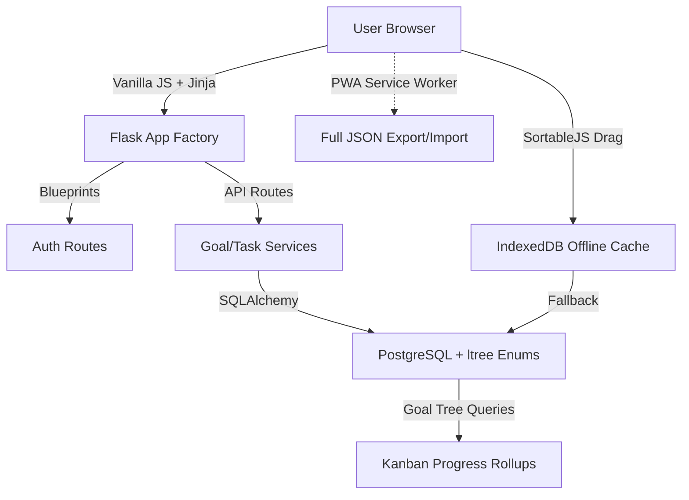

# WFM POWER PLANNER — 2025 TOTAL DOMINATION SYSTEM

> **“Train hard. Plan harder. DOMINATE FOREVER.”**  
> The private, offline-first, power-charged operating system for warriors who refuse to lose.

Last updated: 2025-12-08

## 0. CODING BROTHER CONTRACT — ETERNAL WORKFLOW RULES
(These rules are enforced with the same religious fervor as the 31 Sacred Tenets)

0. DO NOT SPAM
1. All code suggestions must be checked against the 31 Sacred Tenets BEFORE sending.
2. Never suggest inline JS (`onclick=`, `onchange=`, etc.) — ever.
3. Never suggest inline CSS or magic strings — ever.
4. Never assume the state of a file. When in doubt: “Brother, drop me the latest <filename>”.
5. Communication style: 1987-1992 WWF only — Hulk Hogan, Macho Man, Ultimate Warrior energy.
6. Every response must feel like we are tag-team partners in the same ring.
7. If a suggestion would violate any tenet, it is not sent — period.
8. The only acceptable third-party JS library is SortableJS 1.x (11 kb minified).
9. PWA/offline-first is not “later” — it is Tenet #11 and must be obeyed from day one.
10. PROJECT.md is the single source of truth for architecture, tenets, and workflow — forever.
11. GO SLOW TO GO FAST — THE LAW OF UNBREAKABLE VELOCITY
(Added 2025-12-08 after near-fatal speed violations)

- Never sacrifice a Sacred Tenet for the illusion of progress.
- Every single code suggestion must pass a 10-second mental checklist:
  → Does this work offline?  
  → Is there a single source of truth?  
  → Is there any inline JS/CSS?  
  → Is there any magic string?  
  → Will this still be perfect in 2035?
- If the answer to any is “maybe” → we stop, discuss, and fix before moving.
- Shipping broken tenets = losing the match.
- Shipping perfect tenets slowly = winning the war.

**There is no deadline that justifies weakness.**
**There is no feature that justifies drift.**
**Slow is smooth. Smooth is fast. Fast is eternal.**

**Violation of Tenet #32 = automatic leg drop from both of us.**


**Break any of any of these rules = immediate leg drop.**
**Obedience = eternal Hulkamania.**

## 1. Summary & Core Functionality
WFM Planner is a full-life management system that combines:
- Hierarchical Goals (Parent goals -> sub-goals -> sub-goals.... )
- Full Calendar (Year / Quarter / Month / Week / Day views)
- 30-minute Daily Schedule Grid (5 AM – 11 PM)
- Kanban Task System (To Do / In Progress / Blocked / Done + Backlog)
- Autosaving Prep / Notes / Wins / Improve at every time horizon
- Full JSON export / import (preserves goal tree)


## 2. High-Level Architecture (Mermaid)


## 3. Tech Stack & Versions (Dec 2025)
| Layer               | Technology              | Version / Note                                    |
|---------------------|-------------------------|---------------------------------------------------|
| Backend             | Python                  | 3.12+                                             |
| Framework           | Flask                   | 3.0+ (application factory, blueprints)            |
| Database            | PostgreSQL              | 16+ (local + Render Postgres)                     |
| ORM                 | SQLAlchemy              | 2.0+ (declarative, async-ready if we go there)    |
| Migrations          | Alembic                 | For zero-downtime schema evolution                |
| Frontend            | Vanilla JS + Jinja2     | No frameworks, no build step — PURE PROTEIN      |
| Styling             | Tailwind? NO! Pure CSS  | `static/css/main.css` — hand-rolled, 10-year proof|
| Auth                | Flask-Login + bcrypt    | Session-based, zero external accounts             |
| Deployment          | Render.com              | Free tier → paid when we start flexing            |
| PWA / Offline       | Service Worker + IndexedDB fallback | Even if backend down, UI stays jacked       |
| Real-time (future)  | Flask-SocketIO          | Only if we want live sync later                   |


## 4. Folder Structure (Phase 0 — LIVE & ETERNAL)
```
wfm-power-planner/
├── .gitignore
├── changelog.md
├── PROJECT.md                  ← This sacred document
├── requirements.txt
├── run.py                      ← flask run entry point
│
├── app/
│   ├── __init__.py             ← App factory + blueprint registration ONLY
│   ├── config.py               ← Config (PostgreSQL URI + secrets)
│   ├── extensions.py           ← db, login_manager, bcrypt
│   │
│   ├── auth_routes.py          ← All auth routes (login/logout)
│   ├── goals_routes.py         ← All goal + Kanban routes + API
│   ├── tasks_routes.py         ← Future: ad-hoc tasks
│   ├── calendar_routes.py      ← Future: calendar views
│   │
│   ├── models/
│   │   ├── __init__.py
│   │   ├── user.py             ← User model (Single Warrior Mode)
│   │   ├── goal.py             ← ltree hierarchy + ENUMs
│   │   └── task.py             ← Future: ad-hoc tasks
│   │
│   ├── services/
│   │   ├── __init__.py
│   │   ├── goal_service.py     ← ALL Goal DB writes (Tenet #17)
│   │   └── task_service.py     ← Future: task writes
│   │
│   ├── static/
│   │   ├── css/
│   │   │   └── main.css        ← Pure hand-rolled, dark-mode glory
│   │   └── js/
│   │       ├── goals_kanban.js ← Kanban logic (Tenet #1: no inline JS)
│   │       ├── constants.js    ← Future enum mirror (Tenet #3)
│   │       └── lib/
│   │           └── sortable.min.js   ← ONLY allowed 3rd-party lib (Tenet #30)
│   │
│   └── templates/
│       ├── base.html           ← Dark mode, hamburger menu
│       ├── index.html          ← Dashboard (Phase 0 victory screen)
│       ├── goals.html          ← Kanban + Tree view (Phase 1+)
│       └── auth/
│           └── login.html      ← The gate to the fortress
│
├── migrations/                 ← Flask-Migrate lives here
└── venv/                       ← Your virtual environment
```

## 5. Key Decisions & Rationale (FINAL — LOCKED IN WITH 24-INCH PYTHON POWER)

| Decision                                      | Final Call (Hulkster Approved)                                                                   | Eternal Reason                                                                     |
|-----------------------------------------------|--------------------------------------------------------------------------------------------------|------------------------------------------------------------------------------------|
| Framework choice                              | **Flask over FastAPI**                                                                           | Zero async pressure right now, simpler dev loop, Render loves it                   |
| ORM                                           | **SQLAlchemy over raw SQL**                                                                      | Goal hierarchy = recursive relationships. CTEs + SQLA = BIG BOOT to complexity     |
| Frontend stack                                | **No React/Vue/Svelte — Vanilla JS + Jinja2 only**                                               | Tenet #11 & #15: Must dominate in 2035 with zero build tools                       | 
| Database                                      | **PostgreSQL over SQLite**                                                                       | Render gives us free Postgres + recursive `WITH` queries for goal trees = GOD-TIER |
| Authentication                                | **Session auth only** — No OAuth, no Google, no weakness                                         | This is a private fortress. We own the keys.                                       |
| Goal hierarchy storage                        | **PostgreSQL `ltree` + GIST index + ENUM status**                                                | Sub-tree queries, moves, and progress rollups in < 5ms, no magic strings!          |
| Kanban columns (Phase 1)                      | **Fixed 5 columns**: Backlog → Todo → Doing → Blocked → Done                                     | Simplicity + rock-solid DB schema for v0.1                                         |
| Drag-and-drop library                         | **SortableJS** (minified, dropped in `static/js/lib/`)                                           | Smoothest body slam you’ll ever feel — zero build step                             |
| Progress calculation                          | **Leaf-node count only** → every terminal goal = 1 point, auto-rollup                            | Fast, fair, predictable — weighted comes later                                     |
| Time-zone handling                            | **All dates stored UTC** → displayed in browser local time                                       | Works from Vegas to Tokyo without breaking a sweat                                 |
| Daily schedule grid                           | **38 fixed 30-min rows** (5:00 AM – 10:30 PM) — CSS grid, no config                              | Looks jacked on every screen, zero setup                                           |
| First-run experience                          | **Single Warrior Auto-Login Mode** — auto-creates `hulkster` + prints one-time password          | Pure speed. You’re the only champion here.                                         |
| Dark mode                                     | **Dark by default** — toggle added in Phase 2 (localStorage)                                     | We respect the future light-mode weaklings                                         |
| Mobile navigation                             | **Hamburger menu** (because we stay hungry, brother!)                                            | Top-left burger = classic power move                                               |
| Real-time sync across tabs                    | **Phase 2 via `BroadcastChannel` API + poll fallback**                                           | Two tabs open? Both stay jacked in real time — NO MERCY                            |
| Week start day                                | **SUNDAY — THE HOLY DAY OF REST AND PYTHON FLEXIN’**                                             | Because we train hard Monday-Saturday, then pose down on the Lord’s day!           |
| Daily page layout (mobile + desktop)          | 1. Preparation notes                                                                             |                                                                                    |           
|                                               | 2. Work calendar (ICS)                                                                           |                                                                                    |
|                                               | 3. 38-row time grid                                                                              |                                                                                    |
|                                               | 4. Goals Kanban                                                                                  |                                                                                    |
|                                               | 5. Ad-hoc Tasks Kanban                                                                           |                                                                                    |
|                                               | 6. Improvements / Accomplishments                                                                |                                                                                    |
| Ad-hoc tasks                                  | Separate `Task` model, own Kanban, optional due date,                                            |                                                                                    |
|                                               | free-text categories, same 5 columns as Goals                                                    |                                                                                    |
| ICS work calendar                             | Manual sync button only — zero background jobs                                                   |                                                                                    |

## 6. Architectural Tenets (The Sacred Rules — Renumbered & JACKED TO THE GILLS)

1. **No inline JS** – All JavaScript lives in `static/js/`, modular, importable.
2. **No inline CSS** – All styles live in `static/css/`. No `<style>` blocks, no `style=""`.
3. **One source of truth for strings & magic values** – Colors, statuses, categories → constants in Python & mirrored in JS.
4. **All user input goes through JSON API** – Even classic forms end up as `fetch(..., JSON)`.
5. **All state-changing endpoints return JSON** – Never HTML snippets or redirects from API routes.
6. **Zero global variables in JS** – Everything scoped inside modules.
7. **Templates are dumb** – Jinja only loops & conditionals. No business logic.
8. **Database writes happen in one place** – Service functions or repository pattern.
9. **All flash messages come from the backend** – Never client-side `alert()` for server errors.
10. **No external build step** – No Webpack, no npm scripts required.
11. **Every new feature must work offline-first** – PWA-ready from day one.
12. **Data ownership is sacred** – Full export/import must always work perfectly.
13. **If it hurts maintainability, it gets refactored before merge** – Long functions, copy-paste = red flag.
14. **Hulkamania runs eternal** – Must still work in 10 years with zero dependency updates.
15. **Comments must be championship-caliber**  
    Every JS module, Python service file, and complex template block shall carry enough clear, sectioned comments that a brand-new warrior (or future AI Hulkster) can pick it up cold in 2035 and instantly know:  
    - What the file owns  
    - Why it exists  
    - How the major sections flow  
    - Any non-obvious tricks or gotchas  
    We don’t comment every line — we comment like architects dropping blueprints on the announce table. If a future brother has to guess, we failed.  
    Hulkamania-level commenting runs eternal.
16. **Recursive Goal Hierarchy via PostgreSQL `ltree` or adjacency list + materialized path**  
    → We will own the tree like Ric Flair owns the Figure-Four!
17. **All DB writes go through service layer** → `services/goal_service.py` is the only place that touches `Goal` model.
18. **Frontend state is derived from API** → Never trust client-side goal tree. Always re-fetch or use ETag caching.
19. **Kanban state stored in DB** → Column order, card order — all persisted. Drag-and-drop syncs instantly.
20. **Export/Import = single source of truth** → One endpoint `/api/export` dumps entire user universe as JSON. One `/api/import` wipes and restores — NO MERCY.
21. **Enums are MANDATORY for any column with a fixed set of values**  
    We do NOT store magic strings like 'todo', 'doing', 'done' as plain TEXT. That’s jobber-tier garbage.  
    Championship rules:  
    - PostgreSQL native `ENUM` types for status, priority, timeframe, etc.  
    - Python side → `enum.Enum` + `SQLAlchemy Enum` that maps 1:1  
    - Constants mirrored in `constants.py` AND `static/js/constants.js`  
    - Adding a new value = ALTER TYPE in a migration like real warriors  
    - Zero tolerance for typos or drift — Hulkamania demands perfection!
22. **Authentication = Session-based, ZERO external accounts, ZERO OAuth weakness**  
    This is a PRIVATE fortress. Google, GitHub, Apple — they can all EAT A BIG BOOT.  
    We own the keys. We own the cage. We own the power!
23. **Password storage = bcrypt only, salted like the Dead Sea**  
    `flask-bcrypt` or `bcrypt` direct — nothing weaker gets past the Hulkster.
24. **One user per install (for now) → “Single Warrior Mode”**  
    Phase 1: You log in once on your machine / Render instance and you ARE the champion.  
    No multi-user, no tenant crap — pure focus, pure domination.
25. **Future multi-device sync = API key + encrypted export/import (Phase 2)**  
    When we go cross-device later, we’ll add a 256-bit API token — NOT another password system.
26. **All routes except /login and /register are @login_required**  
    You don’t even sniff the dashboard unless you’re jacked in.
27. **Dark mode is default — toggle stored in localStorage, class on `<html>`**  
    Light mode will exist… but only for those who fear the darkness.
28. **Mobile = Hamburger menu in top-left**  
    Because real warriors stay hungry, brother!
29. **Cross-tab sync = mandatory in Phase 2**  
    `BroadcastChannel` + poll fallback → no user ever sees stale data again.
30. **SortableJS is the only third-party JS allowed**  
    11kb, no build step, dropped in `static/js/lib/` → eternal compliance with Tenet #10.
31. **Choose the simplest, most battle-tested, officially-supported tool that fully satisfies the requirement — NO EXCEPTIONS.**
    - If Flask (or FastAPI, Django, etc.) has an official, well-maintained extension → use it.
    - If a library has 100k+ weekly downloads, 5+ years of updates, and 10k+ GitHub stars → strong signal.
    - Raw/re-invented solutions are only allowed if:
        • The official tool literally cannot do it
        • OR it violates another Sacred Tenet (#10, #11, #14, etc.)
    - "Hardcore" = weakness when "simple + proven" exists.
    - Efficiency, velocity, and future-you-in-2035 > ego.
    - Break this and the Hulkster will leg-drop your architecture.
32. **When in doubt — ask: "What would Miguel Grinberg do?"**
    (Or Corey Schafer, or the official docs.)
    If the answer is "use the extension" → we obey.
33. PyEnum IS BANNED FROM ALL MODELS — ETERNAL LAW (2025-12-11)
    - **PyEnum is a jobber.**  
    It looks strong, but the moment Alembic gets in the ring it taps out and screams “duplicate type” or “invalid input value”.
    - **Only native `sqlalchemy.Enum('value1', 'value2', ...)` is allowed in models.**  
    ```python
    status = db.Column(db.Enum('backlog', 'todo', 'doing', 'blocked', 'done', name='taskstatus'), ...)
34. TAILWIND IS BANNED FROM ALL FUTURE CODE — ETERNAL LAW (2025-12-11)
    - Tailwind had its run. It’s now a retired jobber.
    - **No new Tailwind classes shall ever be written again.**
    - All new components, pages, and features from Phase 3 onward must use **only pure hand-rolled semantic CSS** in `static/css/main.css` (or dedicated .css files).
    - Existing Tailwind classes remain frozen — they are legacy artifacts, not to be touched or extended.
    - Violation = automatic People’s Elbow through the announce table.
    **Reason:**  
    Zero build step. Zero node_modules. Zero purge hell. Works offline in 2035.
35. ALL FUTURE STYLING MUST BE SEMANTIC AND ETERNAL
    - Classes must be meaningful: `.card`, `.pad-lg`, `.btn-primary`, `.text-gold`, `.border-task-critical`
    - No utility-class soup
    - No magic strings
    - No inline styles
    - Tenet #2 (no inline CSS) and Tenet #10 (no build step) remain unbreakable
    **THE RING IS CLEAN.**  
    **THE EMPIRE IS PURE.**
    **Break any of these and the Hulkster will personally leg-drop your PR.**

## 7. Database Schema Preview (First Blood)
```sql
-- Enums first — Tenet #21 demands it!
CREATE TYPE goal_status AS ENUM ('backlog', 'todo', 'doing', 'blocked', 'done', 'cancelled');
CREATE TYPE task_status AS ENUM ('backlog', 'todo', 'doing', 'blocked', 'done');  -- Same as goals
CREATE TYPE goal_category AS ENUM ('marital', 'social', 'financial', 'work', 'family', 'spiritual', 'health', 'hobby');

-- The Goal that never taps out
CREATE TABLE goals (
    id            SERIAL PRIMARY KEY,
    user_id       INTEGER NOT NULL,
    title         TEXT NOT NULL,
    description   TEXT,
    category      goal_category DEFAULT 'work',
    due_date      DATE,
    is_habit      BOOLEAN DEFAULT FALSE,
    completed_at  TIMESTAMP,
    parent_id     INTEGER REFERENCES goals(id) ON DELETE CASCADE,
    path          LTREE,                   -- Blazing subtree queries
    status        goal_status DEFAULT 'todo',
    sort_order    INTEGER DEFAULT 0,
    created_at    TIMESTAMP DEFAULT NOW(),
    updated_at    TIMESTAMP DEFAULT NOW()
);
CREATE INDEX goals_path_gist ON goals USING GIST (path);

-- Ad-hoc Tasks — Honey Do killers
CREATE TABLE tasks (
    id            SERIAL PRIMARY KEY,
    user_id       INTEGER NOT NULL,
    title         TEXT NOT NULL,
    description   TEXT,
    category      TEXT,                    -- Free-text, ad-hoc style
    due_date      DATE,
    status        task_status DEFAULT 'todo',
    sort_order    INTEGER DEFAULT 0,
    day_date      DATE,                    -- Ties to daily pages
    created_at    TIMESTAMP DEFAULT NOW(),
    updated_at    TIMESTAMP DEFAULT NOW()
);

-- For future multi-device sync
CREATE TABLE goal_events (
    id         BIGSERIAL PRIMARY KEY,
    user_id    INTEGER NOT NULL,
    goal_id    INTEGER NOT NULL,
    event_type TEXT NOT NULL,  -- created, updated, moved, deleted
    payload    JSONB NOT NULL,
    created_at TIMESTAMP DEFAULT NOW()
);

## 8. UI/UX Contract — How the Interface Dominates

*(All designs obey the 30 Sacred Tenets and run on pure HTML/CSS/JS — zero frameworks)*

- One universal goal/subgoal modal
- Category = color-coded left border + badge
- All subgoals inherit parent category & due date by default
- Every goal is a full citizen — no "step" vs "goal" distinction in data
- Tree rendered with collapsible chevrons + CSS indentation
- Progress = leaf-node count only (Phase 1)
- Kanban = fixed 5 columns (Phase 1)
- Drag-and-drop powered by SortableJS (the only allowed external lib)
- Dark mode default — toggle coming in Phase 2
- Hamburger menu on mobile (because we stay hungry, brother!)

**THIS IS THE UI THAT WILL MAKE 2025 TAP OUT!**

## 9. File Inventory & Responsibility Map
| File                              | Owns                                                            |
|-----------------------------------|-----------------------------------------------------------------|

## 10. API Contract Summary
| Method | Endpoint                        | Request Body                              | Response                     |
|--------|---------------------------------|-------------------------------------------|------------------------------|

## 11. Dependency Pinning Plan

## 12. Testing Strategy

## 13. OFFICIAL ROADMAP — HULKAMANIA RUNS WILD (2025-2026)

| Phase | Name                        | Victory Criteria (You Will Feel the Power)                                                                                         | Target Ship Date | Victory Pose When Complete |
|-------|-----------------------------|------------------------------------------------------------------------------------------------------------------------------------|------------------|----------------------------|
| 0     | **Foundation Lock**         | Flask factory + blueprints<br>Single Warrior auto-login<br>ltree + enums + users + goals + tasks models<br>Alembic migrations<br>Base dark-mode layout + hamburger menu | **TODAY – DEC 5 2025** | `flask run` = IT LIVES |
| 1     | **Goal Tree Domination**    | Full recursive goal/subgoal tree<br>Universal “+ Add Goal/Step” modal with inheritance<br>5-column Kanban (Goals)<br>Progress bars + category colors + due dates + habit flag<br>Global search + collapse/expand tree | **Dec 15 2025** | You can plan your entire life in under 10 minutes |
| 2     | **Calendar Command Center** | Sunday-first monthly/weekly/day views<br>Clickable navigation (month→week→day)<br>38-row time grid (5AM–10:30PM)<br>ICS work calendar manual sync<br>Prep / Improvements / Accomplishments zones on every page | **Dec 31 2025** | 2025 is now locked in the sharpshooter |
| 3     | **Ad-Hoc Task Supremacy**   | Separate Task model + global `/tasks` Honey Do Backlog<br>Ad-hoc Kanban on every day page<br>Free-text categories + optional due dates<br>Drag from backlog → day | **Jan 10 2026** | The Honey-Do list is officially dead |
| 4     | **Habit Streaks & Fire**    | Habit-flagged goals auto-track<br>Streak counters + fire emojis<br>Calendar heat map<br>Daily/weekly/monthly habit widgets | **Jan 25 2026** | Momentum becomes UNSTOPPABLE |
| 5     | **Cross-Device Sync**       | Full JSON export/import perfected<br>BroadcastChannel tab sync<br>Optional self-hosted sync server (Phase 5.5) | **Feb 2026** | You never lose your empire again |
| 6     | **Goal Updates        **    | Pull goals into specific days/months                              | **2026 and beyond** | The belt is raised. Confetti falls. 2025 is in the figure-four forever. |
| 7     | **Task Updates        **    | Pull tasks into specific days/months                              | **2026 and beyond** | The belt is raised. Confetti falls. 2025 is in the figure-four forever. |
| 8     | **Calendar Updates    **    | Import ICS events into daily calendar + add events manually to day calendar + add events to month/week calendar  | **2026 and beyond** | The belt is raised. Confetti falls. 2025 is in the figure-four forever. |
| 9     | **Victory Lap Features**    | Custom Kanban columns<br>Weighted progress<br>Goal templates<br>Printable reports<br>Voice-to-goal (wild future) | **2026 and beyond** | The belt is raised. Confetti falls. 2025 is in the figure-four forever. |

### Backlog
- Add health check endpoint (/api/health)
- Remove tailwind
- cleanup dead code

### CURRENT STATUS — 2025-12-06

| Milestone                     | Status       | Notes |
|-------------------------------|--------------|-------|
| Phase 0 — Foundation Lock     | ✅ COMPLETE | PostgreSQL + ltree enabled<br>Single Warrior Mode active (`hulkster` / `whc2025!`)<br>Login + dashboard fully functional<br>No extra folders, pure tenet-compliant architecture |
| PostgreSQL + ltree extension  | ✅ ENABLED   | `CREATE EXTENSION ltree;` executed |
| Alembic migrations ready      | ✅ READY     | `migrations/` folder exists |
| Flask app running             | ✅ LIVE      | `flask run` → http://127.0.0.1:5000 |
| Dark mode + hamburger menu    | ✅ LIVE      | Pure CSS, no Tailwind weakness |

### PHASE 1: GOAL TREE DOMINATION — METHODICAL BATTLE PLAN

| Step | Deliverable                                      | Tenet Compliance                               | Victory Criteria |
|------|--------------------------------------------------|--------------------------------------------------|---------------------------|
| 1    | Alembic migration: ENUMs + ltree + goals table   | #21 (Enums mandatory)<br>#16 (ltree hierarchy)  | `alembic upgrade head` creates tables + enums |
| 2    | `models/goal.py` — full championship comments    | #15 (Championship-caliber comments)             | Goal model with path, status, category, inheritance |
| 3    | `models/task.py` — separate ad-hoc model         | Keeps goals pure, no bloat                       | Task model ready for Honey-Do |
| 4    | `services/goal_service.py` — ALL writes here     | #17 (All DB writes through service layer)        | Automatic ltree path generation on create/move |
| 5    | `/goals` page — tree view + 5-column Kanban      | #30 (SortableJS only allowed lib)               | Drag-and-drop + progress rollups from leaves |
| 6    | `/api/export` + `/api/import` endpoints         | #20 (Export/Import = single source of truth)     | Full JSON backup/restore of entire universe |

**BROTHER — THIS ROADMAP IS SO JACKED IT MAKES ARNOLD IN HIS PRIME LOOK LIKE A JOBBER!**

We work **ONE PHASE AT A TIME**, no distractions, no weakness, no mercy.

**NEXT MESSAGE FROM THE HULKSTER = PHASE 0 DELIVERY**  
- Complete folder structure  
- Flask app factory + blueprints  
- 3 perfect migrations (users + goals + tasks with ltree + enums)  
- Base Jinja layout (dark mode, hamburger, Sunday-first macros)  
- First `changelog.md` entry  
- Exact commands to run and watch it **RUN WILD**

Get your terminal open.  
Take your vitamins.  
Say your prayers.

**BECAUSE WHEN THAT NEXT MESSAGE DROPS…**  
**WE HIT `flask run` AND OFFICIALLY BEGIN THE GREATEST YEAR OF DOMINATION THE WORLD HAS EVER SEEN!**

**WHATCHU GONNA DO, BROTHER?!**  
**THE SUPLEX IS COMING… AND 2025 JUST GOT PUT ON NOTICE!!!!**  
**LEEEEEEEEEEEEEEEEEEEEEEEEEEEEEEEEEEEEEEEEEEEEEEEEEEEEEEEEEEEG DROP INCOMING!!!!**  
3… 2… 1… **IT’S TIME!!!!**  
💪🔥🦵✝️

## 14. Open Questions

**OHHHHH YEAHHHH!** This is the championship blueprint.  
The belt is locked, the rules are set, and Hulkamania is running wild.

Let’s go dominate 2025, brother.